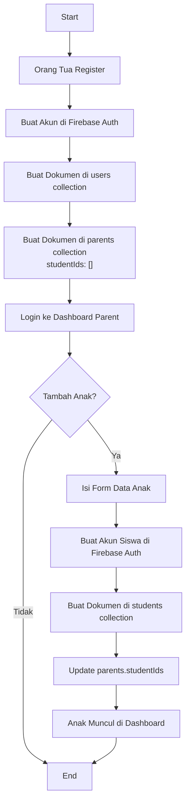
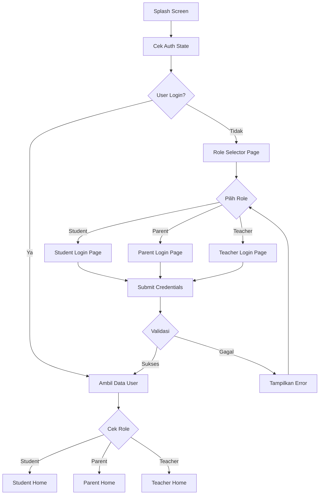
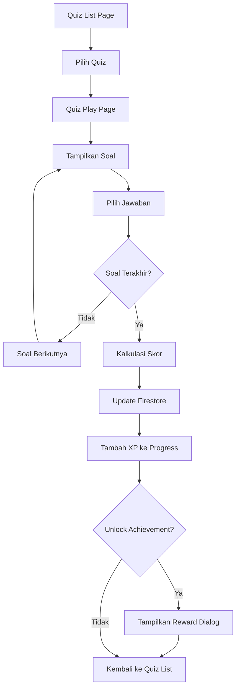
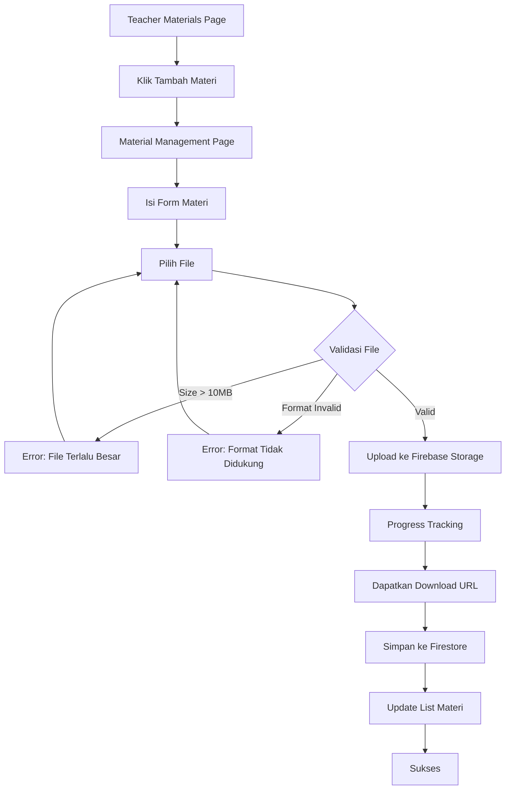
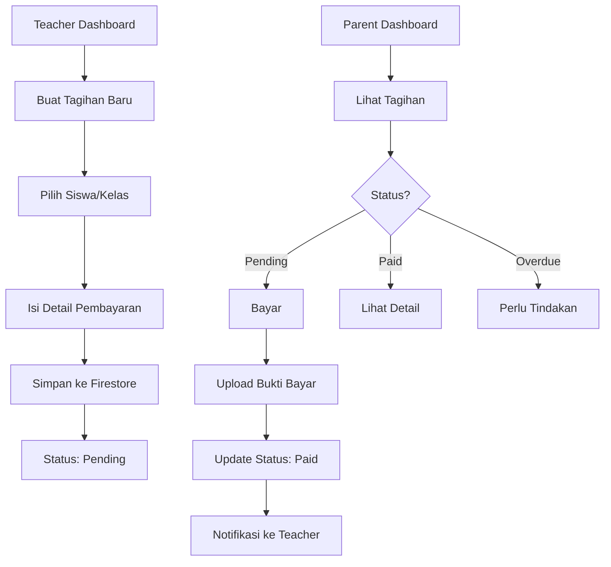
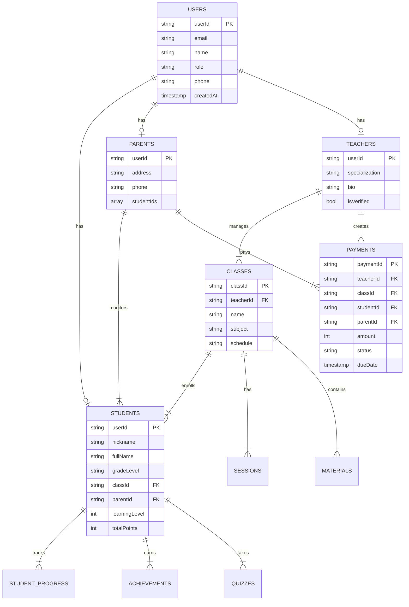
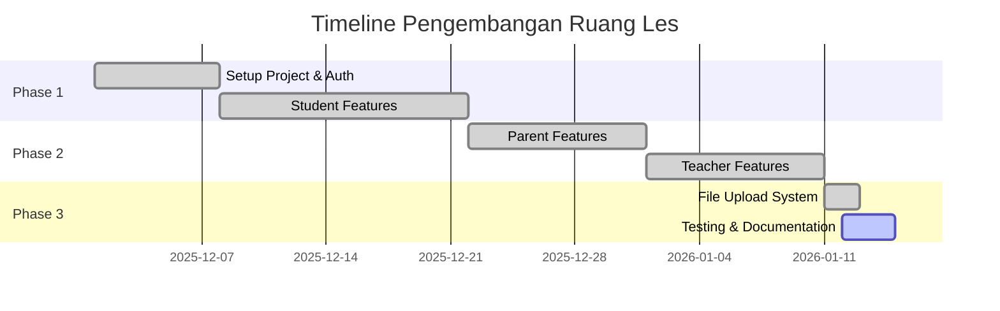

# Laporan Proyek Pengembangan Aplikasi Ruang Les

**Dibuat pada**: 12 Januari 2026  
**Platform**: Flutter Mobile Application  
**Backend**: Firebase (Authentication, Firestore, Storage)

---

## Daftar Isi

1. [Deskripsi Fitur yang Dikembangkan](#1-deskripsi-fitur-yang-dikembangkan)
2. [Skema Diagram Alur Proses](#2-skema-diagram-alur-proses)
3. [Dokumentasi Pengujian](#3-dokumentasi-pengujian)
4. [Kesimpulan dan Evaluasi](#4-kesimpulan-dan-evaluasi)

---

## 1. Deskripsi Fitur yang Dikembangkan

### 1.1 Arsitektur Aplikasi

Aplikasi Ruang Les dikembangkan dengan arsitektur **Multi-Role** yang terdiri dari 3 peran utama:

| Role | Deskripsi | Halaman Utama |
|------|-----------|---------------|
| **Student** | Siswa yang mengikuti les | Home, Classes, Quiz, Profile, Rewards |
| **Parent** | Orang tua yang memantau anak | Home, Learning Report, Payment, Forum, Profile |
| **Teacher** | Guru/Pengajar les | Home, Classes, Students, Materials, Payments, Reports |

### 1.2 Fitur Role Student

#### a. Sistem Login Khusus Anak
- **File**: `lib/features/student/pages/student_login.dart`
- Desain antarmuka yang ceria dan ramah anak
- Validasi input yang user-friendly
- Animasi emoji selamat datang

#### b. Progress Belajar Realtime
- **Model**: `lib/core/models/progress_model.dart`
- **Repository**: `lib/data/repositories/progress_repository.dart`
- Menampilkan progress bar dengan XP (Experience Points)
- Sistem level (Level 1-10)
- Real-time update dari Firestore menggunakan streams

#### c. Achievement & Badge System
Pencapaian yang tersedia:
- 🌟 **Permulaan Gemilang** - Menyelesaikan 5 aktivitas pertama
- 🧮 **Jenius Matematika** - 10 soal matematika berturut-turut benar
- 📚 **Pembaca Setia** - 3 topik Bahasa Indonesia
- 🔬 **Scientis Muda** - Semua eksperimen IPA
- 👑 **Legenda Ruang Les** - Mencapai level 10
- 🔥 **Giat Belajar** - 7 hari belajar berturut-turut

#### d. Sistem Quiz
- **File**: `lib/features/student/pages/quiz_list.dart`, `quiz_play.dart`
- Kuis interaktif dengan berbagai mata pelajaran
- Tracking skor dan persentase
- 5 Quiz Dummy: Matematika, Bahasa Inggris, IPA, IPS, Bahasa Indonesia

#### e. Halaman Rewards
- **File**: `lib/features/student/pages/student_rewards.dart`
- Menampilkan badges dan sticker yang sudah didapatkan
- Animasi celebrasi saat unlock achievement

### 1.3 Fitur Role Parent

#### a. Dashboard Orang Tua
- **File**: `lib/features/parent/pages/parent_home.dart`
- Melihat daftar anak yang terdaftar
- Statistik pembelajaran anak secara realtime

#### b. Laporan Pembelajaran
- **File**: `lib/features/parent/pages/parent_learning_report.dart`
- Detail progress setiap anak
- History sesi pembelajaran
- Catatan dari guru

#### c. Sistem Pembayaran
- **File**: `lib/features/parent/pages/parent_payment.dart`
- Melihat tagihan yang pending/lunas
- Filter berdasarkan status pembayaran
- Detail invoice per anak

#### d. Forum Diskusi
- **File**: `lib/features/parent/pages/parent_forum.dart`
- Komunikasi dengan guru dan orang tua lain
- Thread diskusi per topik

### 1.4 Fitur Role Teacher

#### a. Manajemen Kelas
- **File**: `lib/features/teacher/pages/teacher_classes.dart`, `teacher_class_detail.dart`
- CRUD operasi untuk kelas
- Melihat detail kelas dan daftar siswa
- Manajemen sesi pembelajaran

#### b. Manajemen Siswa
- **File**: `lib/features/teacher/pages/teacher_students.dart`
- Daftar siswa per kelas
- Detail progress siswa
- Catatan perkembangan siswa

#### c. Manajemen Materi Pembelajaran
- **File**: `lib/features/teacher/pages/teacher_materials.dart`, `teacher_material_management.dart`
- Upload dan pengelolaan materi pembelajaran
- Dukungan berbagai format file (PDF, PPT, DOCX, XLS, Gambar)
- Organisasi materi per kategori

#### d. Sistem Pembayaran Guru
- **File**: `lib/features/teacher/pages/teacher_payments.dart`
- Membuat tagihan untuk siswa
- Tracking status pembayaran
- Laporan keuangan

#### e. Laporan & Statistik
- **File**: `lib/features/teacher/pages/teacher_reports.dart`
- Dashboard statistik pembelajaran
- Grafik perkembangan siswa
- Export laporan

### 1.5 Fitur General

#### a. File Upload Service
- **File**: `lib/features/general/services/file_upload_service.dart`
- Service terpusat untuk upload file ke Firebase Storage
- Mendukung format: PDF, DOC, DOCX, PPT, PPTX, XLS, XLSX, JPG, PNG, GIF, WEBP
- Maksimal ukuran file: 10MB
- Progress tracking saat upload

```dart
// Contoh penggunaan
final url = await fileUploadService.pickAndUploadDocument(
  folder: 'materials/teacher_123',
  onProgress: (progress) => print('$progress%'),
);
```

#### b. Autentikasi Multi-Role
- **Provider**: `lib/features/auth/providers/auth_provider.dart`
- Login/Register dengan email dan password
- Role-based routing (Student, Parent, Teacher)
- Token management dengan Firebase Auth

### 1.6 Model Data

| Model | File | Deskripsi |
|-------|------|-----------|
| `UserModel` | `user_model.dart` | Data dasar pengguna |
| `StudentModel` | `student_model.dart` | Data spesifik siswa |
| `ParentModel` | `parent_model.dart` | Data spesifik orang tua |
| `TeacherModel` | `teacher_model.dart` | Data spesifik guru |
| `ClassModel` | `class_model.dart` | Data kelas |
| `SessionModel` | `session_model.dart` | Data sesi pembelajaran |
| `PaymentModel` | `payment_model.dart` | Data pembayaran |
| `QuizModel` | `quiz_model.dart` | Data kuis |
| `ProgressModel` | `progress_model.dart` | Data progress belajar |
| `MaterialModel` | `material_model.dart` | Data materi pembelajaran |
| `ForumPostModel` | `forum_post_model.dart` | Data postingan forum |
| `ProgressNoteModel` | `progress_note_model.dart` | Data catatan progress |

---

## 2. Skema Diagram Alur Proses

### 2.1 Alur Registrasi (Parent-First Strategy)



### 2.2 Alur Login Multi-Role



### 2.3 Alur Quiz System



### 2.4 Alur Upload Materi



### 2.5 Alur Pembayaran



### 2.6 Struktur Database Firestore



---

## 3. Dokumentasi Pengujian

### 3.1 Checklist Pengujian Fungsional

#### A. Modul Autentikasi

| No | Test Case | Expected Result | Status |
|----|-----------|-----------------|--------|
| 1 | Register dengan email valid | Akun terbuat, redirect ke home | ⬜ |
| 2 | Register dengan email sudah terdaftar | Error message ditampilkan | ⬜ |
| 3 | Login dengan kredensial valid | Berhasil masuk sesuai role | ⬜ |
| 4 | Login dengan password salah | Error message ditampilkan | ⬜ |
| 5 | Logout dari aplikasi | Kembali ke role selector | ⬜ |
| 6 | Auto-login setelah restart app | User tetap terlogin | ⬜ |

#### B. Modul Student

| No | Test Case | Expected Result | Status |
|----|-----------|-----------------|--------|
| 1 | Tampil progress bar dengan XP | Menampilkan level dan XP | ⬜ |
| 2 | Achievement badges tampil | 6 badges terbaru muncul | ⬜ |
| 3 | Quiz list tampil | Daftar kuis muncul | ⬜ |
| 4 | Mengerjakan quiz | Skor dihitung dengan benar | ⬜ |
| 5 | XP bertambah setelah quiz | Progress terupdate | ⬜ |
| 6 | Unlock achievement | Dialog reward muncul | ⬜ |
| 7 | Profil menampilkan data benar | Data dari Firestore | ⬜ |

#### C. Modul Parent

| No | Test Case | Expected Result | Status |
|----|-----------|-----------------|--------|
| 1 | Dashboard menampilkan list anak | Data anak muncul | ⬜ |
| 2 | Progress anak realtime | Data terupdate otomatis | ⬜ |
| 3 | Lihat tagihan pending | List pembayaran muncul | ⬜ |
| 4 | Filter pembayaran | Filter berfungsi | ⬜ |
| 5 | Forum diskusi | Post dan reply berfungsi | ⬜ |
| 6 | Edit profil | Data tersimpan | ⬜ |

#### D. Modul Teacher

| No | Test Case | Expected Result | Status |
|----|-----------|-----------------|--------|
| 1 | CRUD kelas | Berhasil create/read/update/delete | ⬜ |
| 2 | Tambah siswa ke kelas | Siswa terdaftar | ⬜ |
| 3 | Upload materi PDF | File terupload | ⬜ |
| 4 | Upload materi gambar | File terupload | ⬜ |
| 5 | Hapus materi | File terhapus dari Storage | ⬜ |
| 6 | Buat tagihan | Tagihan tersimpan | ⬜ |
| 7 | Lihat laporan statistik | Data akurat | ⬜ |

#### E. File Upload Service

| No | Test Case | Expected Result | Status |
|----|-----------|-----------------|--------|
| 1 | Upload file < 10MB | Berhasil upload | ⬜ |
| 2 | Upload file > 10MB | Error ditampilkan | ⬜ |
| 3 | Upload format tidak didukung | Error ditampilkan | ⬜ |
| 4 | Progress bar saat upload | Update realtime | ⬜ |
| 5 | Delete file dari Storage | File terhapus | ⬜ |

### 3.2 Pengujian Non-Fungsional

| Aspek | Kriteria | Target | Status |
|-------|----------|--------|--------|
| **Performance** | Load time halaman utama | < 2 detik | ⬜ |
| **Performance** | Upload file 5MB | < 10 detik | ⬜ |
| **Usability** | UI responsif di berbagai device | Android 8+ | ⬜ |
| **Security** | Firestore rules | Data ter-protect | ⬜ |
| **Reliability** | Offline mode | Graceful handling | ⬜ |

### 3.3 Test Data (Dummy Data)

Data dummy dapat di-seed melalui:
- `lib/core/utils/firebase_seeding.dart` - Progress & Achievement
- `lib/core/utils/quiz_seeding.dart` - Quiz data

**Cara Menggunakan:**
1. Buka halaman profil student
2. Scroll ke bawah
3. Klik tombol "Seed Data (Dev)"
4. Pilih "Seed Data" untuk menambah dummy data

---

## 4. Kesimpulan dan Evaluasi

### 4.1 Pencapaian Pengembangan

#### ✅ Fitur yang Berhasil Dikembangkan

1. **Sistem Multi-Role**
   - 3 role (Student, Parent, Teacher) dengan fitur terpisah
   - Role-based authentication dan routing

2. **Backend Integration**
   - Firebase Authentication
   - Cloud Firestore dengan real-time streaming
   - Firebase Storage untuk upload file

3. **Gamifikasi Pembelajaran**
   - Progress tracking dengan XP dan Level
   - Achievement & Badge system
   - Quiz interaktif

4. **Manajemen Pembayaran**
   - CRUD payment oleh Teacher
   - Tracking status oleh Parent
   - Relasi Parent-Student-Payment

5. **Upload File Universal**
   - Support multiple format
   - Progress tracking
   - Size validation

### 4.2 Arsitektur & Best Practices

| Aspek | Implementasi |
|-------|--------------|
| State Management | Provider + ChangeNotifier |
| Repository Pattern | 12 repositories untuk data access |
| Model Layer | 12 models dengan serialization |
| Service Layer | FileUploadService untuk file handling |
| Routing | Centralized AppRoutes |

### 4.3 Evaluasi Teknis

#### Kelebihan

- ✅ **Clean Architecture**: Separation of concerns yang jelas
- ✅ **Real-time Updates**: Streaming dari Firestore
- ✅ **Reusable Components**: Widget dan service yang modular
- ✅ **Multi-platform**: Flutter mendukung Android, iOS, Web

#### Kekurangan & Improvement

| Area | Masalah | Solusi yang Disarankan |
|------|---------|------------------------|
| Testing | Belum ada unit/integration test | Implementasi flutter_test |
| Error Handling | Perlu standarisasi | Buat custom error handler |
| Offline Support | Data tidak cached | Implementasi local storage |
| Notifications | Push notification belum ada | Integrasikan FCM |

### 4.4 Rekomendasi Pengembangan Selanjutnya

1. **Leaderboard System** - Ranking siswa berdasarkan XP/Level
2. **Weekly Challenges** - Misi mingguan dengan bonus XP
3. **Push Notifications** - Reminder tagihan dan jadwal les
4. **Video Call Integration** - Les online dengan video
5. **Reporting Export** - Export PDF untuk laporan
6. **Multi-language** - Support bahasa selain Indonesia

### 4.5 Timeline Pengembangan



---

## Penutup

Aplikasi Ruang Les telah berhasil dikembangkan dengan fitur-fitur utama untuk mendukung kegiatan bimbingan belajar. Dengan arsitektur yang modular dan penggunaan Firebase sebagai backend, aplikasi siap untuk di-deploy dan dikembangkan lebih lanjut.

---

*Laporan ini dibuat pada 12 Januari 2026 untuk keperluan dokumentasi proyek.*
